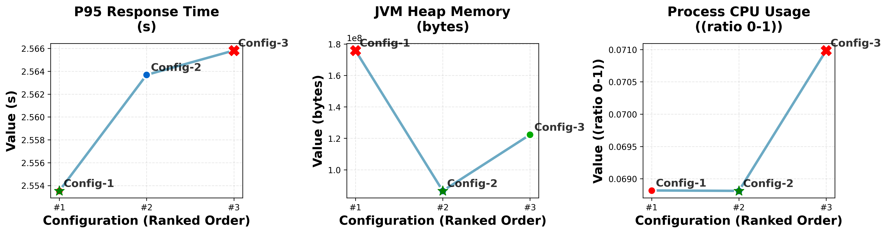

# MARIONETTE: Automated A/B Testing Framework for Microservices


Marionette, a framework enabling fine-grained runtime behavioural configuration in microservice architectures.
It provides a non-intrusive approach to instrument microservices, allowing external control over behavioural decisions without requiring code changes or service restarts, as traditional deployment strategies. The framework is then employed to design an automated A/B/n testing pipeline that compares all possible system-level combinations of behaviours across the microservices composing the application.

## 📋 Table of Contents

- [Overview](#-overview)
- [Architecture](#️-architecture)
- [Prerequisites](#-prerequisites)
- [Installation & Setup](#-installation--setup)
- [Project Structure](#-project-structure)
- [Usage Guide](#-usage-guide)
- [Scripts Reference](#️-scripts-reference)
- [Results & Visualization](#-results--visualization)
- [Troubleshooting](#-troubleshooting)
- [Contributing](#-contributing)

## 🎯 Overview

Marionette enables fine-grained instrumentation of microservices to define internally multiple behavioural variants and allow externalised control over them. It also provides an automated A/B/n testing pipeline designed to explore all the system-level combinations of behaviours and compare them. It enables researchers and developers to:

- **Configure multiple behavioural variants** inside a microservice using XML-based configuration.
- **Control the behaviour** of single microservices through a centralised service offering a graphical interface.
- **Deploy and manage A/B/n tests** systematically exploring all system-level combinations of behaviours.
- **Simulate user load** with a customizable script.
- **Monitor real-time metrics** during test execution.
- **Generate comprehensive visualizations** of test results.
- **Compare performance** across different service configurations.

### Components

1. **Outfit App** (`01-outfit-app/`): Target microservice application for instrumentation of behaviuoral variants and A/B/n testing.
2. **Marionette Tool** (`02-marionette-tool/`): Code transformation engine.
3. **Control Plane** (`03-marionettist/`): Centralised control interface and test orchestration.
4. **User Simulator** (`04-user-simulator/`): User load simulation tool.
5. **Result Visualizer** (`05-result-visualiser/`): Automated chart generation from obtained results.
6. **Automation Scripts** (`06-scripts/`): Helper utilities and browser automation.

## 🔧 Prerequisites

### System Requirements

- **Operating System**: Linux, macOS, or Windows with WSL2
- **CPU**: 4+ cores recommended
- **RAM**: 8GB minimum, 16GB recommended
- **Disk Space**: 10GB free space

### Required Software

#### Core Dependencies

```bash
# Kubernetes and Container Runtime
minikube (v1.25+)
kubectl (v1.25+)
docker (v20.10+)

# Development Tools
java (JDK 17+)
maven (v3.8+)
node.js (v16+)
npm (v8+)

# System Tools
python3 (v3.8+)
pip3
curl
jq
git
```

### Kubernetes Cluster Setup

The framework requires a Kubernetes cluster with specific addons:

#### Minikube Configuration
```bash
# Start minikube with sufficient resources
minikube start --cpus=4 --memory=8192 --disk-size=20g

# Enable required addons
minikube addons enable ingress
minikube addons enable metrics-server
minikube addons enable dashboard
```

#### Required Kubernetes Features
- **Ingress Controller**: NGINX ingress (enabled via minikube addon)
- **Metrics Server**: For resource monitoring
- **Persistent Volumes**: For data storage
- **Service Monitoring**: Prometheus operator (auto-installed)

## 🚀 Installation & Setup

### 1. Clone the Repository
```bash
git clone https://github.com/sissamatteo29/MarionetteReplicationPackage.git
cd MarionetteReplicationPackage
```

### 2. Verify Prerequisites
```bash
# Check Kubernetes cluster
kubectl cluster-info

# Verify minikube addons
minikube addons list | grep -E "(ingress|metrics-server)"

# Check Java version
java -version

# Check Python version
python3 --version
```

### 3. Prepare the Environment
```bash
# Make scripts executable
chmod +x *.sh
chmod +x 06-scripts/*.sh

# Verify Docker environment (will be configured automatically)
minikube status
```

## 📖 Usage Guide

The framework follows a simple three-step workflow:

### Step 1: Deploy the System
```bash
./build-deploy.sh
```

### Step 2: Run A/B Tests
```bash
./start-ab-test.sh
```

### Step 3: Download Results
```bash
./download-results.sh
```

### Detailed Workflow

1. **Initial Deployment**: Sets up all services and opens browser tabs
2. **Test Configuration**: Use the web interface to configure test parameters
3. **Load Testing**: Automated user simulation with real-time monitoring
4. **Results Analysis**: Automatic download and visualization generation

## 🛠️ Scripts Reference

### Core Scripts

#### `build-deploy.sh` 🔧
**Purpose**: Complete system deployment and setup

**What it does**:
- Configures Minikube Docker environment
- Builds all microservice variants using Marionette transformation tool
- Compiles and containerizes services (outfit-app + marionette control plane)
- Deploys services to Kubernetes with ingress configuration
- Opens browser tabs for both applications

**Usage**:
```bash
./build-deploy.sh
```

**Prerequisites**:
- Minikube running with ingress addon enabled
- Docker environment available
- Java 17+ and Maven installed

**Output**:
- All services deployed to `outfit-app` namespace
- Two browser tabs opened:
  - Marionette Control Plane: `http://<minikube-ip>:30081`
  - Outfit App UI: `http://<minikube-ip>`

---

#### `start-ab-test.sh` 🚀
**Purpose**: Execute A/B/n tests with automated monitoring

**What it does**:

- Creates a tmux session with 5 monitoring panes:
  - **Pane 1**: UI Service logs
  - **Pane 2**: Image Store Service logs  
  - **Pane 3**: Image Processor Service logs
  - **Pane 4**: Marionettist logs
  - **Pane 5**: User Simulator (load testing)
- Triggers test start on the Marionettist service (30 mins per configuration, 8 hours in total)
- Triggers user simulation (3 users, cycle of 30 min)

**Usage**:
```bash
./start-ab-test.sh
```

**Prerequisites**:
- Services deployed via `build-deploy.sh`
- tmux installed
- Both Marionette and Outfit App endpoints accessible

**Session Management**:
```bash
# Attach to existing session
tmux attach-session -t marionette-monitoring

# Kill session manually if needed
tmux kill-session -t marionette-monitoring
```

---

#### `download-results.sh` 📊

**Purpose**: Download test results and generate comprehensive visualizations. It should be used **after** the test has been completed with the `./start-ab-test.sh` script.

**What it does**:

- Downloads last test results from the Marionettist service
- Creates timestamped results directory under `results/`
- Automatically sets up Python virtual environment
- Generates 6 different visualization types:
  1. **System Comparison**: System-level comparison with multi-line chart
  2. **Radar Chart**: Multi-dimensional performance view at the system-level
  3. **Individual Metrics**: Metric-by-metric analysis
  4. **Service-Level Comparison**: Per-service performance breakdown
  5. **Aggregate Metrics**: Bar chart showing metrics values at the system-level
  6. **Configuration Overview**: Visual summary of test configurations

**Usage**:
```bash
./download-results.sh
```

**Generated Files**:
```
results/ab_test_YYYYMMDD_HHMMSS/
├── test_results.json           # Raw test data
├── individual_metrics.png      # Performance by metric
├── system_comparison.png       # Overall comparison
├── aggregate_metrics.png       # Combined values
├── service_level_comparison.png # Per-service analysis
├── configuration_overview.png  # Configuration summary
└── radar_chart.png            # Multi-dimensional view
```


### Utility Scripts

#### `06-scripts/monitor-logs.sh`
Sets up log monitoring in tmux panes for real-time debugging.

#### `06-scripts/open-browser.sh`
Cross-platform browser opening utility that works on Linux, macOS, and Windows.

#### `06-scripts/setup-visualizer.sh`
Manual Python environment setup script (optional, as `download-results.sh` handles this automatically).

### Service-Specific Scripts

#### `01-outfit-app/build-deploy-outfit-app.sh`
Builds and deploys the target microservice application with A/B test variants.

#### `03-marionettist/build-deploy-marionettist.sh`
Builds and deploys the Marionette control plane with React frontend.

## 📈 Results & Visualization

### Experiment Results

After running a comprehensive 8-hour A/B/n test with **16 different system configurations** across all three microservices (Image Store, Image Processor, and UI Service), the following results were obtained. Each configuration was tested for 30 minutes with 3 concurrent users.

### Behavioral Variants Tested

| Service | Behavioral Aspect | Available Options |
|---------|------------------|-------------------|
| **Image Store** | Image compression | compression (default), no compression |
| **Image Processor** | Enhancement algorithm | manual (default), ImageJ library |
| **Image Processor** | Result caching | without cache (default), with cache |
| **UI Service** | Interface complexity | beautiful UI (default), simple UI |

### Key Findings

The experiment revealed several important insights about microservice performance optimization:


The **top 3 configurations** all shared common characteristics:

- ✅ **Image compression enabled** - consistently improves performance
- ✅ **Simple UI interface** - reduces response time and CPU usage
- ⚠️ **Cache implementation** showed unexpected trade-offs

#### Counter-Intuitive Cache Results

Surprisingly, the **best-performing configuration did not use caching**. Investigation revealed that the cache implementation uses thread-safe locks (`ReentrantReadWriteLock`) which creates bottlenecks:

- Cache reduces image fetching but increases response time due to locking
- Write operations block both other writes and reads
- Thread contention negatively impacts performance under concurrent load

### Visualization Analysis

#### System-Level Performance Comparison


The system comparison chart shows performance differences across the top configurations, highlighting the trade-offs between response time and memory usage.

#### Aggregate Metrics Analysis


**Key observations:**

- **Response Time**: Top configurations show similar P95 response times
- **Memory Usage**: Significant differences due to caching strategy
- **CPU Usage**: Cache implementation doubles CPU usage for Image Processor service

#### Multi-Dimensional Performance View


The radar chart provides a normalized view showing:

- **Config-1**: Best response time, worst memory usage
- **Config-2**: Best memory efficiency (uses cache), moderate response time  
- **Config-3**: Balanced but overall lower performance

#### Service-Level Breakdown


Service-level analysis reveals:

- **Image Processor**: Most critical service showing major performance variations
- **Cache impact**: Memory usage more than halved when cache is enabled
- **ImageJ library**: Better response time but higher memory consumption vs manual processing

#### Individual Metrics Deep Dive



Detailed metric analysis showing specific performance characteristics across all measured dimensions.

### Experiment Conclusions

1. **Definitive Wins**: Some optimizations consistently improve performance:
   - Image compression should always be enabled
   - Simple UI interface provides clear benefits

2. **Trade-off Discoveries**: The cache implementation revealed important trade-offs:
   - Reduces memory footprint significantly
   - Increases response time due to locking overhead
   - Doubles CPU usage in the Image Processor service

3. **Fine-grained Insights**: Method-level A/B testing enabled discovery of:
   - ImageJ library vs manual processing trade-offs
   - Thread-safety bottlenecks in cache implementation
   - Service-specific performance impacts

### Metrics Collected

- **Response Time**: P95 response time in seconds
- **Memory Usage**: JVM heap memory consumption in bytes  
- **CPU Usage**: Process CPU utilization (0-1 ratio)


## 🔍 Troubleshooting

### Common Issues

#### Minikube Issues

```bash
# Minikube not running
minikube start --cpus=4 --memory=8192

# Ingress not working
minikube addons enable ingress
kubectl get pods -n ingress-nginx

# Check ingress status
kubectl get ingress -n outfit-app
```

#### Service Discovery Issues

```bash
# Check service status
kubectl get services -n outfit-app
kubectl get pods -n outfit-app

# Check ingress configuration
kubectl describe ingress outfit-app-ingress -n outfit-app

# Manual endpoint testing
curl -f http://$(minikube ip):30081/actuator/health
curl -f http://$(minikube ip)
```

#### Build Issues

```bash
# Java version issues
java -version  # Should be 17+
export JAVA_HOME=/path/to/java17

# Maven issues
mvn -version
which mvn

# Docker environment
eval $(minikube docker-env)
docker images
```

#### Python Environment Issues

```bash
# Python dependencies
python3 --version  # Should be 3.8+
pip3 --version

# Manual environment setup
cd 05-result-visualiser
python3 -m venv venv
source venv/bin/activate
pip install -r requirements.txt
```

## 🤝 Contributing

Contributions are welcome! Please feel free to submit a Pull Request.
